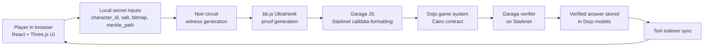

# guessNFT

> A fully onchain deduction game on Starknet where players answer hidden-character questions with zero-knowledge proofs instead of trust.

`guessNFT` takes the familiar "Guess Who?" loop and rebuilds it as a Dojo game: the turn order, commitments, guesses, reveals, and timeout logic all live onchain, while the secret answer to each question stays private. The only way to make that work without a trusted server is to generate a proof client-side in Noir and verify it onchain in Cairo through a Garaga-generated verifier.

## Why this project matters

In a normal web game, the answering player can always lie unless you trust a backend. In a naive onchain game, publishing the answer leaks the secret character. This project solves that tradeoff:

- The game state is onchain in a Dojo world.
- Each player commits to a hidden character before play starts.
- The answering player generates a ZK proof that their yes/no answer matches the committed character.
- The Cairo game contract accepts the answer only after Garaga verifies the proof.
- The character itself stays hidden until the reveal phase.

That is the core hackathon claim: this is not just "a game with NFTs". It is a trustless multiplayer game loop that only works cleanly because Starknet, Cairo, Noir, and Garaga are working together.

## The stack, in one sentence

Dojo manages the authoritative game state, Cairo enforces the rules, Noir defines what a valid hidden answer means, `bb.js` generates the proof in the browser, Garaga turns that proof into Starknet calldata and verifies it onchain, Torii streams the world state back to the client, and Cartridge is the intended wallet/session UX layer for real players.

## Architecture diagram



## What the proof actually proves

For every answer, the circuit proves all of this at once:

1. The player is answering about the same character they committed to earlier.
2. That character belongs to the official SCHIZODIO collection snapshot for this match.
3. The answer bit for the asked question is correct for that character's trait bitmap.
4. The proof is tied to this exact `game_id`, `turn_id`, `player`, and `question_id`, so it cannot be replayed elsewhere.

The circuit is in [`packages/circuits/src/main.nr`](packages/circuits/src/main.nr). The verifier checks those claims onchain in [`packages/contracts/src/systems/game_actions.cairo`](packages/contracts/src/systems/game_actions.cairo).

## Match flow

```text
Player 1 creates game on Starknet
  -> Dojo stores game session + traits_root

Player 2 joins
  -> game moves to COMMIT_PHASE

Both players commit twice
  -> Pedersen commitment for final reveal
  -> Poseidon2 BN254 commitment for ZK answer proofs

Active player asks a question
  -> Dojo records turn and sets awaiting_answer = true

Answering player's browser generates proof
  -> load bitmap + Merkle path
  -> Noir witness generation
  -> UltraHonk proof via bb.js
  -> Garaga calldata formatting

Answering player submits proof onchain
  -> Cairo checks anti-replay fields + commitment + traits root
  -> Garaga verifier validates the proof
  -> contract writes the answer and flips the turn

Final guess happens onchain
  -> both players reveal
  -> Cairo resolves the winner from the original commitments
```

## Where each technology fits

| Layer | Role in this project |
| --- | --- |
| Starknet | Settlement layer for the match and proof verification |
| Cairo | Game rules, commitment checks, reveal logic, timeout logic |
| Dojo | World, models, events, and indexable game state |
| Torii | Real-time sync from onchain models into the frontend |
| Noir | Circuit for hidden-answer correctness |
| `@aztec/bb.js` | Witness generation helpers and UltraHonk proof generation in the browser |
| Garaga | Starknet verifier generation and calldata formatting |
| Cartridge | Intended wallet/session UX for real players |
| React + Three.js | Frontend, board rendering, and game UI |

## Why the proof is generated in the client

The browser already knows the player's secret character, salt, bitmap, and Merkle path. That makes the client the only place where witness generation should happen. The contract should never see those private inputs. So the architecture is:

- private inputs stay in the browser
- public inputs go to Starknet
- proof generation happens in a Web Worker
- proof verification happens onchain

This is implemented in [`src/zk/workers/prover.worker.ts`](src/zk/workers/prover.worker.ts) and orchestrated by [`src/zk/useZKAnswer.ts`](src/zk/useZKAnswer.ts).

## Collection and proof model

The SCHIZODIO collection is preprocessed into a proof-friendly dataset:

- `999` characters
- a `1024`-leaf Poseidon2 Merkle tree
- a `418`-question trait schema packed into `[u128; 4]`
- a single `traits_root` committed to each game at creation time

That dataset is generated into `public/collections/schizodio.json`, then loaded by the client during proof generation.

## Repo map

```text
packages/circuits/         Noir circuit proving answer correctness
packages/contracts/        Dojo world + Cairo game system
packages/verifier/         Garaga-generated Cairo verifier
src/zk/                    Client-side ZK flow, Torii sync, worker prover
src/core/                  Shared game rules and state store
src/services/starknet/     Wallet/NFT integration and legacy commit-reveal helpers
scripts/                   Collection prep, deploy, proof, and E2E validation scripts
docs/                      Architecture, proof flow, and local dev docs
```

## Documentation for judges

- [Architecture](docs/ARCHITECTURE.md)
- [ZK Proof Flow](docs/ZK_PROOF_FLOW.md)
- [Local Dev Guide](docs/DEV-GUIDE.md)
- [Contracts README](packages/contracts/README.md)

If you want the shortest path, read them in that order.

## Local quick start

Frontend only:

```bash
npm install
npm run dev
```

Full local onchain stack:

```bash
katana --dev --dev.no-fee --http.cors_origins "*"
bash scripts/deploy-local.sh
torii --world <WORLD_ADDRESS> --rpc http://localhost:5050
npm run dev
```

The full local workflow, proof scripts, and deployment notes are documented in [docs/DEV-GUIDE.md](docs/DEV-GUIDE.md).

## Validation scripts

Useful commands when you want to prove the pipeline is real:

```bash
bash scripts/prove.sh
npx tsx scripts/test-client-proof-pipeline.ts
npx tsx scripts/test-e2e-proof-submission.ts
```

Those cover:

- Noir circuit compilation
- local witness solving
- local proof generation
- Garaga calldata generation
- proof acceptance by the onchain verifier path

## Important implementation note

The gameplay brand is `guessNFT`, but several packages and contract artifacts still use the earlier internal name `whoiswho`. That is expected in the current repo. For the hackathon explanation, the important source-of-truth paths are:

- `src/zk/*` for the live ZK online flow
- `packages/circuits/*` for the Noir circuit
- `packages/contracts/*` for the Dojo/Cairo game system
- `packages/verifier/*` for the Garaga verifier

## License

MIT
