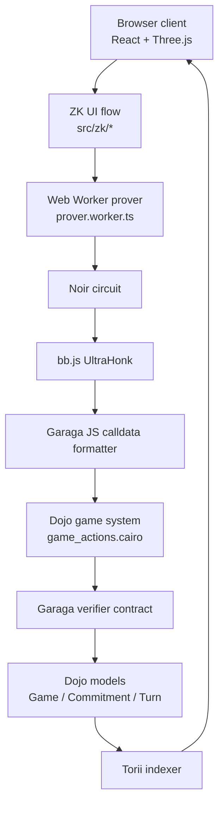

# Architecture

This document explains the full hackathon architecture in judge-friendly terms: what runs onchain, what runs in the client, and why both sides are necessary.

## System overview

```text
React + Three.js UI
  -> local game store and ZK UI flow
  -> Torii subscription for onchain sync
  -> Web Worker proving pipeline

Noir circuit + bb.js + Garaga (client)
  -> prove hidden answer correctness
  -> format Starknet calldata

Dojo world + Cairo game system (chain)
  -> own match state
  -> enforce rules and phase transitions
  -> verify proof metadata
  -> call Garaga-generated verifier

Garaga verifier contract (chain)
  -> verify UltraKeccakZKHonk proof

Torii (indexer)
  -> stream Game / Commitment / Turn model updates back to the client
```

## Diagram



## The design goal

The game must satisfy two constraints at the same time:

1. The answer to a question must be correct.
2. The secret character must remain hidden until the reveal phase.

If you solve only the first problem, you leak the character. If you solve only the second, players can lie. The architecture here solves both:

- Cairo owns the game state.
- Noir defines correctness.
- the browser generates the witness and proof.
- Garaga verifies the proof on Starknet.

## Source-of-truth files

If you want to inspect the actual implementation, these are the most important files:

- [`src/App.tsx`](../src/App.tsx): switches into the ZK UI flow when mode is `zk-online`
- [`src/zk/ui/ZKUIOverlay.tsx`](../src/zk/ui/ZKUIOverlay.tsx): main ZK multiplayer overlay
- [`src/zk/useToriiGameSync.ts`](../src/zk/useToriiGameSync.ts): Torii-driven onchain sync and proof lifecycle
- [`src/zk/useZKAnswer.ts`](../src/zk/useZKAnswer.ts): create/join/commit/ask/prove/guess/reveal transactions
- [`src/zk/workers/prover.worker.ts`](../src/zk/workers/prover.worker.ts): witness generation, proof generation, Garaga calldata formatting
- [`packages/circuits/src/main.nr`](../packages/circuits/src/main.nr): Noir circuit
- [`packages/contracts/src/systems/game_actions.cairo`](../packages/contracts/src/systems/game_actions.cairo): Dojo/Cairo system
- [`packages/contracts/src/models/game.cairo`](../packages/contracts/src/models/game.cairo): onchain models

## Layer by layer

### 1. Frontend and game UX

The frontend is a React app with a Three.js board. The normal game UX lives in `src/core/*` and `src/ui/*`, while the trustless online flow is layered in `src/zk/*`.

Key point: this is not a separate prototype. The app actually switches to the ZK path when the selected mode is `zk-online`.

### 2. Dojo world and Cairo rules

The onchain game is modeled as Dojo data:

- `Game`: session metadata, phase, turn, last question, winner
- `Commitment`: each player's reveal commitment and ZK commitment
- `Turn`: each asked question or guess, plus verified answer status

Those models live in [`packages/contracts/src/models/game.cairo`](../packages/contracts/src/models/game.cairo).

The system contract in [`packages/contracts/src/systems/game_actions.cairo`](../packages/contracts/src/systems/game_actions.cairo) owns the lifecycle:

- `create_game`
- `join_game`
- `commit_character`
- `ask_question`
- `answer_question_with_proof`
- `make_guess`
- `reveal_character`
- `claim_timeout`

This is where the game becomes properly onchain: turn order, phase validity, commitment binding, reveal logic, and timeout behavior are all enforced by Cairo instead of UI assumptions.

### 3. Noir circuit

The Noir circuit is the privacy layer.

It proves that:

- the answerer knows a secret `character_id` and `salt`
- those secrets match the onchain ZK commitment
- the trait bitmap belongs to the official SCHIZODIO snapshot
- the asked question maps to the claimed answer bit

The circuit returns only one public output: the answer bit.

That means the chain learns the answer, not the whole character.

### 4. Garaga verifier

Garaga is the bridge between the proof system and Starknet:

- it generates the Cairo verifier contract in `packages/verifier`
- it formats proof data into Starknet-compatible calldata

The game contract does not generate proofs. It verifies proof metadata and then delegates the cryptographic proof check to the Garaga-generated verifier.

That distinction matters:

- proof generation: browser
- proof verification: Starknet

### 5. Torii sync

Torii is the real-time read path. The client subscribes to Dojo model updates so both players see the same game state without building a custom backend.

This is implemented in:

- [`src/zk/toriiClient.ts`](../src/zk/toriiClient.ts)
- [`src/zk/useToriiGameSync.ts`](../src/zk/useToriiGameSync.ts)

That hook watches onchain state changes and reacts to them by:

- committing when a local player selects a secret character
- sending asked questions onchain
- generating proofs when the local player needs to answer
- updating the UI when verified answers land onchain
- revealing characters at the end

### 6. Cartridge and Starknet wallet path

Cartridge is the intended wallet/session UX layer for real players. The wallet integration exists in [`src/services/starknet/sdk.ts`](../src/services/starknet/sdk.ts) and related files.

For local development, the active ZK flow currently uses Katana dev accounts through [`src/zk/zkSdk.ts`](../src/zk/zkSdk.ts). That lets the hackathon team test the full proof system without depending on production wallet/session wiring.

So the architecture is:

- local demo flow: Katana accounts
- production UX direction: Cartridge Controller + Starknet sessions

## End-to-end sequence

```text
1. Player 1 calls create_game(traits_root, question_set_id)
2. Player 2 calls join_game(game_id)
3. Both players call commit_character(pedersen_commitment, zk_commitment)
4. Active player calls ask_question(question_id)
5. Answering player reads:
   - game_id
   - turn_count
   - question_id
   - local secret character
   - local salt
   - bitmap + Merkle path from schizodio.json
6. Browser worker generates:
   - Noir witness
   - UltraHonk proof
   - Garaga calldata
7. Answering player calls answer_question_with_proof(game_id, calldata)
8. Cairo checks:
   - phase and actor
   - game_id
   - turn_id
   - player
   - question_id
   - traits_root
   - zk_commitment
9. Cairo calls the Garaga verifier
10. If valid, Cairo writes the answer and flips the turn
11. Final guess is submitted onchain
12. Both players reveal
13. Cairo resolves the winner from the original commitments
```

## Why Dojo is a good fit

Dojo is not just a storage choice here. It is the right fit because the game is fundamentally a world state machine:

- each match is a world entity set
- each turn is an indexed model update
- Torii can subscribe to the world directly
- the game logic stays inside a Cairo system instead of a custom offchain server

This gives the project an architecture judges can reason about:

- onchain writes are authoritative
- onchain reads are indexable
- UI sync comes from the world, not from hidden backend state

## Why this is stronger than a server-based version

A centralized version of this game is easy to build. A trustless version is not.

Without this architecture, you must choose one of these weaker models:

- trust a backend to check answers
- leak too much data onchain
- trust the answering player

The current design removes the backend from the trust model while preserving secrecy until the reveal phase.

## Current implementation notes

Two repo details are worth calling out:

1. The code still uses `whoiswho` in package names, contract names, and artifacts. That is legacy naming, not a separate project.
2. The `src/zk/*` path is the live ZK multiplayer implementation. Some `src/services/starknet/*` files still describe older or compatibility-oriented flows.

For hackathon explanations, lead with the architecture above and point judges to the exact files listed in this document.
